## Executive Summary

The dataset contains **7,043 telecom customers** and a binary churn outcome.  
The analysis shows that churn is concentrated in a small number of structural and behavioral patterns rather than being evenly distributed across the customer base.

### Headline metrics

- **Overall churn rate:** 26.5%
- **Tenure below 12 months:** 47.4% churn
- **Month-to-month contracts:** 42.7% churn
- **Electronic check users:** 45.3% churn
- **Fiber optic customers:** 41.9% churn

### Strategic takeaway

The strongest retention opportunities lie in:

1. reducing exposure to low-commitment structures,
2. stabilizing the first year of the customer lifecycle,
3. reviewing the service experience for fiber optic customers,
4. using predictive scores to prioritize intervention.

## Business Context

Customer churn is a revenue leakage problem in subscription businesses.  
The purpose of this analysis is not only to identify which groups churn more, but to determine **where retention efforts should start first**.

The dataset supports a full analytical loop:

1. data quality validation,
2. behavioral segmentation,
3. exploratory diagnosis,
4. predictive prioritization,
5. recommendation design.

## Data Understanding

- **Rows:** 7,043
- **Columns:** 21 raw variables
- **Target:** `Churn`
- **Grain:** customer-level snapshot

The variables cover demographics, service usage, account structure, and payment behavior.  
Because the dataset is a snapshot rather than a time-stamped behavioral sequence, the findings are best interpreted as **strong associations with business relevance**, not causal proof.

## Data Quality

The primary cleaning issue was `TotalCharges`, which was stored as text.

### Cleaning results

| Check | Result |
|---|---|
| `TotalCharges` after numeric coercion | 11 missing values |
| Business interpretation | all correspond to `tenure = 0` |
| Cleaning action | fill missing values with `0` |
| Duplicate rows | 0 |
| Remaining nulls after cleaning | None |

This preserves legitimate newly activated customers instead of excluding them.

## Feature Engineering

Several features were added to improve interpretability:

- `tenure_group`
- `charge_band`
- `num_addon_services`
- `is_new_customer`
- `has_internet`
- `is_high_value`

### Feature highlights

| Feature summary | Value |
|---|---:|
| New customers (0–12 months) | 2,186 |
| Loyal customers (49–72 months) | 2,239 |
| Very new customers (≤ 3 months) | 1,062 |
| Average add-on services | 2.04 |

These engineered fields make the churn patterns easier to read through lifecycle, value, and service-depth lenses.

## Exploratory Analysis

### Churn Overview

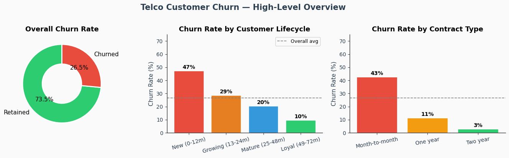

This view establishes the baseline. Churn is already clearly concentrated among **new customers** and **month-to-month contracts**, pointing to low commitment and early lifecycle instability as the dominant themes.

### Tenure and Lifecycle

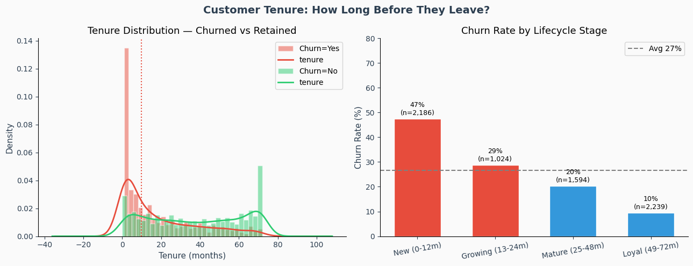

| Lifecycle segment | Churn rate |
|---|---:|
| New (0–12m) | 47% |
| Growing (13–24m) | 29% |
| Mature (25–48m) | 20% |
| Loyal (49–72m) | 10% |

The first year is the main retention risk window. Churn drops sharply once customers move beyond early lifecycle stages.

### Monthly Charges and Value Sensitivity

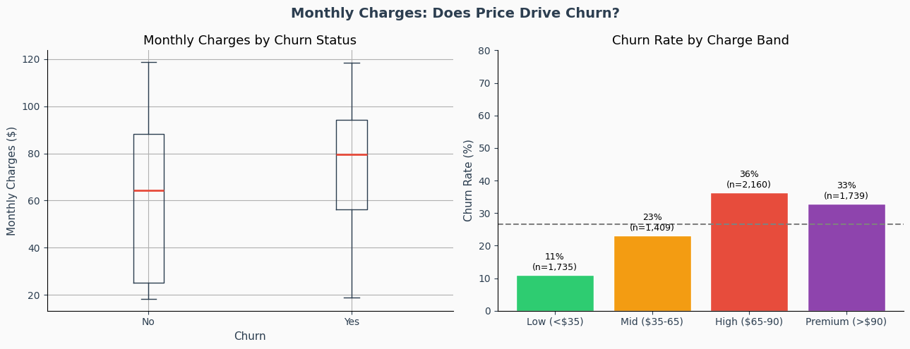

| Charge band | Churn rate |
|---|---:|
| Low (<$35) | 11% |
| Mid ($35–65) | 23% |
| High ($65–90) | 36% |
| Premium (>$90) | 33% |

Higher monthly charges are associated with greater churn, but the relationship is not purely linear. This suggests the issue is likely **perceived value**, not price alone.

### Internet Service Type

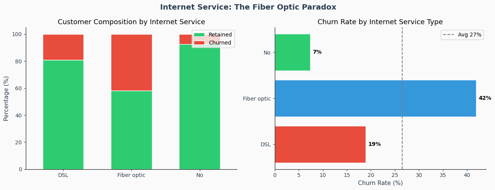

| Internet service | Churn rate |
|---|---:|
| No internet | 7% |
| DSL | 19% |
| Fiber optic | 42% |

Fiber optic is a high-risk segment despite likely being a higher-value product, suggesting a gap in service experience, pricing fit, or competitive positioning.

### Contract Type

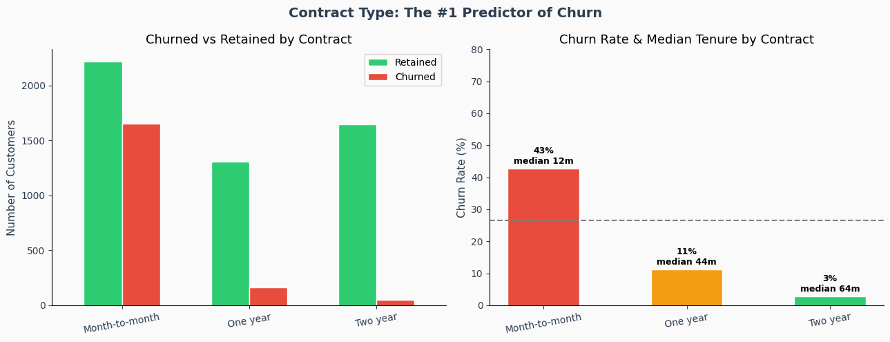

| Contract type | Churn rate | Median tenure |
|---|---:|---:|
| Month-to-month | 43% | 12 months |
| One year | 11% | 44 months |
| Two year | 3% | 64 months |

Contract structure is one of the strongest churn drivers. Long-term contracts materially reduce churn and increase customer longevity.

### Add-on Services and Protective Features

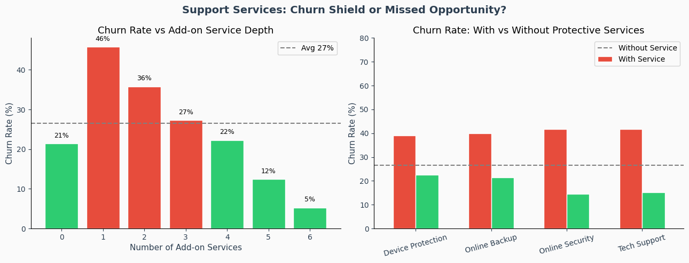

The relationship between add-ons and churn is non-linear. Customers with **1–3 add-on services** churn more than deeply embedded customers with **5–6 services**.  
At the same time, the absence of **Online Security** or **Tech Support** corresponds to churn near **42%**, reinforcing the retention value of protective services.

### Payment Method

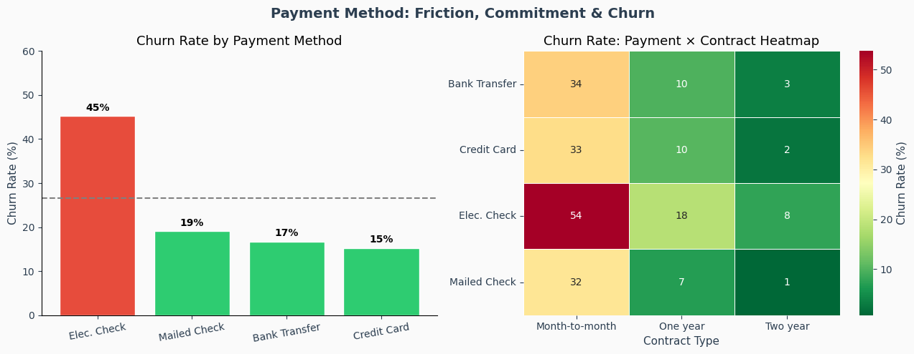

| Payment method | Churn rate |
|---|---:|
| Electronic check | 45% |
| Mailed check | 19% |
| Bank transfer | 17% |
| Credit card | 15% |

Electronic check appears to proxy for low automation, low commitment, and higher friction. The heatmap shows this risk becomes even stronger when paired with month-to-month contracts.

### Demographic Context

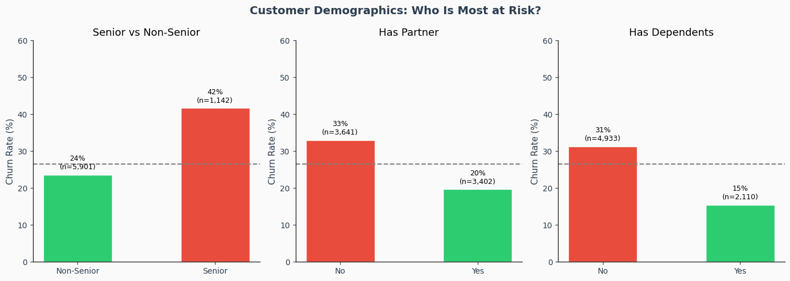

| Segment | Churn rate |
|---|---:|
| Senior customers | 42% |
| Non-seniors | 24% |
| No partner | 33% |
| With partner | 20% |
| No dependents | 31% |
| With dependents | 15% |

Demographics add targeting context, but they are weaker intervention levers than lifecycle, contract, and payment structure.

### Multi-Variable Risk Map

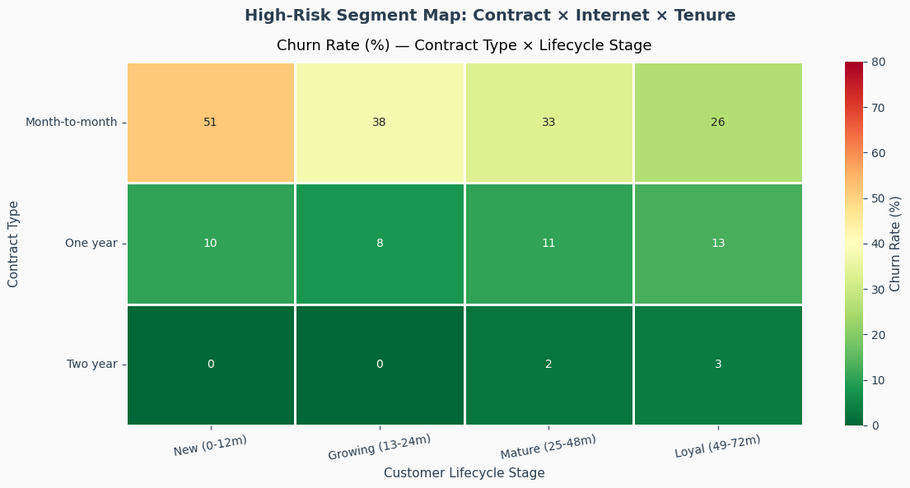

The most important risk intersection is:

- **Month-to-month + New (0–12m): 51% churn**

This shows that the most meaningful churn patterns emerge when multiple risk factors overlap.

### Churn Driver Summary

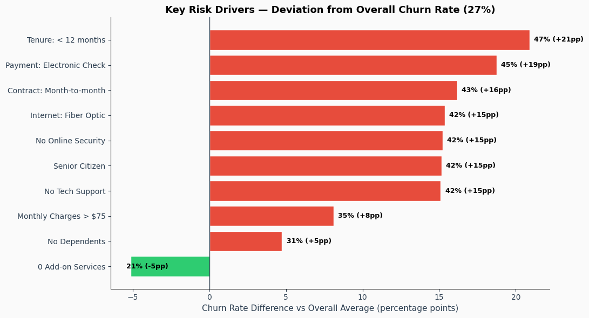

Largest positive deviations from the **26.5%** baseline:

| Segment | Churn rate | Delta vs baseline |
|---|---:|---:|
| Tenure < 12 months | 47% | +21pp |
| Electronic check | 45% | +19pp |
| Month-to-month | 43% | +16pp |
| Fiber optic | 42% | +15pp |
| No online security | 42% | +15pp |
| Senior citizen | 42% | +15pp |
| No tech support | 42% | +15pp |

Together, the EDA points to three core churn dimensions:

1. **Commitment**  
2. **Lifecycle stage**  
3. **Service value and support fit**

## Predictive Modeling

The modeling section is used as a **prioritization layer**, not as a replacement for analysis.

### Model performance

| Model | ROC-AUC | Accuracy | Precision (Churn) | Recall (Churn) |
|---|---:|---:|---:|---:|
| Logistic Regression | **0.8393** | 0.74 | 0.51 | **0.80** |
| Random Forest | 0.8374 | **0.77** | **0.55** | 0.69 |

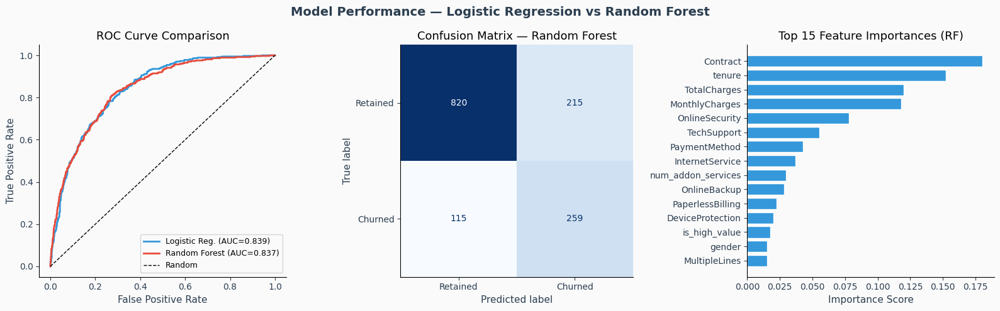

Both models perform similarly, which indicates that the churn signal is stable rather than model-specific.

### Risk score distribution

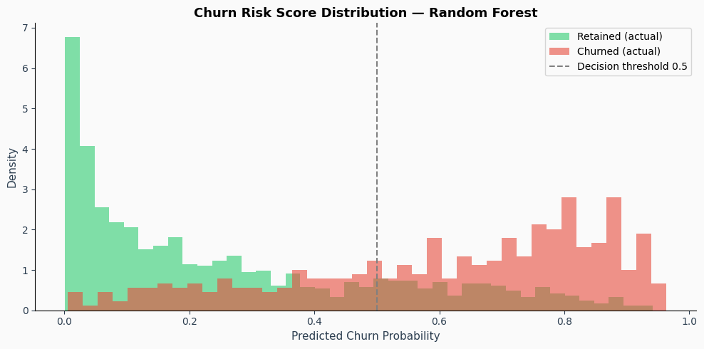

The probability separation is strong enough to support **risk-based triage**, especially when intervention budgets are limited.

## Recommendations

### 1. Contract conversion
- **Evidence:** Month-to-month churn is 42.7%
- **Action:** Incentivize migration into 1-year plans, especially for early-tenure customers

### 2. Early lifecycle retention
- **Evidence:** Tenure below 12 months churn is 47.4%
- **Action:** Build retention workflows during the first 30 / 60 / 90 / 180 days

### 3. Autopay adoption
- **Evidence:** Electronic check churn is 45.3%
- **Action:** Promote automatic payment through convenience and pricing incentives

### 4. Fiber optic service review
- **Evidence:** Fiber optic churn is 41.9%
- **Action:** Review plan positioning, service quality, and support experience

### 5. Support-service bundling
- **Evidence:** Customers without Online Security or Tech Support churn at around 42%
- **Action:** Test protective-service bundles for higher-risk customer segments

## Decision Framework

| Initiative | Expected Impact | Feasibility | Priority |
|---|---|---|---|
| Contract conversion | High | High | 1 |
| Autopay adoption | High | High | 1 |
| Early lifecycle retention | High | Medium | 2 |
| Fiber optic service review | High | Medium | 2 |
| Support-service bundling | Medium | Medium | 3 |
| Demographic personalization | Medium | Medium | 3 |

## Analytical Limits

- Customer snapshot rather than a behavioral time series
- Associations rather than causal proof
- Missing variables such as support tickets, outage history, NPS, and acquisition channel
- No exact revenue impact modeling without margin and lifetime assumptions

## Final Conclusion

Churn in this telecom dataset is concentrated in a small number of high-risk conditions:

- early lifecycle,
- low-commitment structures,
- fiber optic and higher-charge value sensitivity,
- lack of protective support services.

The analysis moves beyond description by identifying **where intervention should begin first** and by providing a practical path from EDA to retention prioritization.
